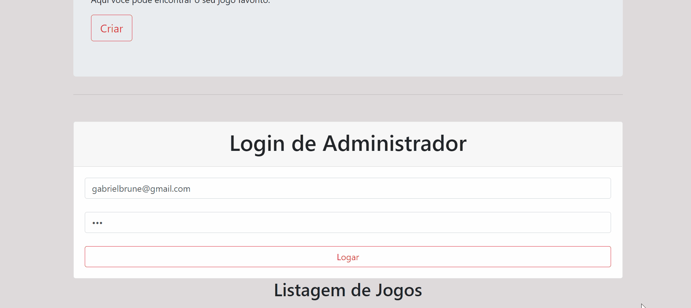

<h1 align="center">
    
</h1>
<p align="center"> 
  <p>Esta plataforma é o consumo de uma API Restful, utilizando todos os padrões de uma boa Api. Além de estarem protegidas pelo JWT</h2>
 <h3>Consumo da API Restfull</h3>
<hr>
 
<hr>


<h2> &#xf21b; Login</h2>
<b>Email:</b>admin@teste.com<br>
<b>Senha:</b>123


<h2> :bulb: Funcionalidades</h2>

* Criar Game;

* Deletar Game;

* Listar Game;

* Se autenticar;

* Autenticação de administrador.

<h2> :wrench: Pré-requisitos</h2>

 Antes de começar, você vai precisar ter instalado em sua máquina as seguintes ferramentas:
[Git](https://git-scm.com), [Node.js](https://nodejs.org/en/). Além disto é bom ter um editor para trabalhar com o código como o [VSCode](https://code.visualstudio.com/)

:rocket: Para rodar a aplicação

  ```bash

# Clone este repositório
$ git clone https://github.com/Gabriel52/API-Restfull

# Acesse a pasta do projeto no seu terminal/cmd
$ cd APIdegames

# Execute o comando na pasta CRUD(DESAFIO) para instalar todas as dependências
$ npm install ou yarn

# Execute a aplicação em modo de desenvolvimento, é importante executar este
$ yarn start

# A aplicação web será aberta na porta:3000 - acesse http://localhost:3000

 ```

## 🛠 Tecnologias
Node.js (Back-End);

Express(Back-End);

JWT (Token);

bcryptjs (criptografar a senha);

HTML + Bootstrap 4 (Web Front-End);

MySQL (Banco de Dados);

Sequelize (ORM)

<h2> :book: Licença </h2>
<p>Lançado em 2020 :book:</p></br>
<p>Feito por Gabriel Brune :rocket:. Este projeto está sobre a licença do MIT</p></br>
<p>Dar uma :star: se este projeto te ajudou</p>

<h2> 🐛 Problemas</h2
<p>Sinta-se à vontade para registrar um novo problema com o respectivo título e descrição no repositório Proffy . Se você já encontrou uma solução para seu problema, eu adoraria revisar sua solicitação de pull !</p>


